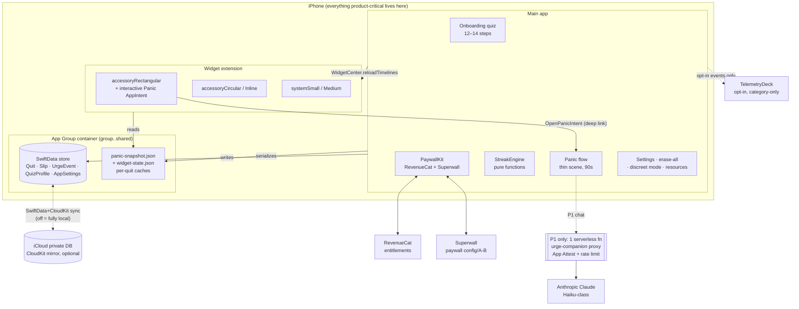

# Architecture: Unhooked — The Quit-Anything Streak Widget

| Field | Value |
|---|---|
| Document | Architecture v1.0 |
| Date | 2026-07-07 |
| Inputs | `prd.md` (PRD v1.0), `feasibility-report.md` (GO WITH CAUTION), `mvp.md` |
| Portfolio cluster | A2 — Native Swift, local-first, no backend |
| Platforms | iOS 26+ (iPhone only, v1) |

> **Naming note:** per the feasibility report, "Unhooked" is a pre-build rename gate. This document uses the working title. Nothing in the architecture depends on the name; the bundle ID, App Group ID, and CloudKit container ID must be created **after** the rename to avoid burning identifiers.

---

## 1. System Overview

Unhooked is a **client-only iOS app**. There is no backend, no accounts, and no server-side state for the entire v1 (MVP) scope. All product data — quits, streaks, slips, quiz answers, urge events — lives in a SwiftData store inside an App Group container shared between the main app and its widget extension, with optional mirroring to the user's private iCloud (CloudKit) database. The only network traffic in v1 is to three managed SaaS endpoints: RevenueCat (entitlements), Superwall (paywall config/A-B), and TelemetryDeck (opt-in, category-level analytics). Privacy is not a feature layered on; it is the shape of the system — there is no server to breach, which the MVP explicitly converts into paywall copy ("No account. No server. Nothing to leak.").

The product's soul is the **lock-screen panic path**: an interactive AppIntents button on an accessoryRectangular widget that must land the user in a full-screen intervention in under 2 seconds cold. This drives the two most consequential architectural decisions: (1) a **thin launch path** — the panic scene renders from a pre-serialized "panic snapshot" (the user's own motivations, current streak, breath-pacer config) stored as plain JSON in the App Group, so the intervention appears before SwiftData, RevenueCat, or anything else finishes initializing; (2) a **write-then-reload** data discipline — every streak-affecting write commits locally first, then calls `WidgetCenter.reloadTimelines`, so widgets are fresh within seconds of an event and no user action ever depends on the network.

P1 adds the single permitted server component: **one rate-limited serverless function** proxying the AI urge companion to Claude (Haiku-class), authenticated by App Attest rather than user identity, with transcripts stored on-device only. Nothing else grows a backend. The system is deliberately boring: the engineering risk is concentrated in launch-path latency, streak time integrity, and funnel instrumentation correctness — all testable as pure functions or measurable release criteria — while the business risk (distribution) lives outside the codebase entirely.

### High-level diagram



---

## 2. Technology Stack

Aligned with the portfolio strategy (Cluster A2). Every third-party dependency gets a one-line "why this and not the alternative."

| Layer | Choice | Why this, not the alternative |
|---|---|---|
| Language / UI | **Swift 6 + SwiftUI** | Portfolio Cluster A mandate; widgets/AppIntents ARE the product — no cross-platform framework can render interactive lock-screen widgets. RN/Expo (Cluster B) is disqualified by WidgetKit alone. |
| Widgets | **WidgetKit + AppIntents** (interactive), **ActivityKit** (P1 Live Activity) | Only API surface for interactive lock-screen buttons; no alternative exists. |
| Persistence | **SwiftData** (App Group store) | Portfolio A2 standard; ~5-entity model doesn't justify GRDB/SQLite's extra control; SwiftData's built-in CloudKit mirroring gives sync for free. GRDB rejected: more power we don't need, no free CloudKit path. |
| Sync | **CloudKit private database** via SwiftData's CloudKit mirroring | Zero-server sync under the user's own Apple ID; Supabase-as-store rejected — any server-side habit data is an existential liability post-Quittr-breach. |
| Payments | **StoreKit 2 via RevenueCat** (`purchases-ios`) | Portfolio standard ("one billing brain"); cross-app entitlement dashboards; StoreKit-direct rejected: no A/B or cohort tooling, and every other portfolio app is on RevenueCat. |
| Paywall A/B | **Superwall** (`superwall-ios`) | Explicitly sanctioned by portfolio strategy for Unhooked because paywall experimentation IS the business (price test $29.99 vs $39.99, teaser-vs-hard, remotely switchable without releases). RevenueCat Paywalls rejected: weaker experimentation/targeting for the Quittr-proven quiz→paywall funnel. |
| Analytics | **TelemetryDeck** (opt-in, default off) | Portfolio default; privacy-first, no device IDs, compatible with honest App Privacy labels. PostHog/Amplitude rejected: SDK weight + privacy optics unacceptable in this category. |
| Crash reporting | **MetricKit + Xcode Organizer** | Portfolio standard for native apps; zero third-party crash SDK in a privacy-absolutist app. Sentry rejected: third-party SDK contradicts the trust positioning. |
| AI (P1 only) | **Anthropic Claude Haiku-class**, behind one serverless function (Cloudflare Worker) | Portfolio "one API key discipline"; Haiku is sufficient for scripted urge-surfing coaching and ~10x cheaper than Sonnet; OpenAI rejected to avoid splitting portfolio key/eval/prompt tooling. Worker over Supabase edge fn: no other Supabase surface exists in this app, so a single stateless Worker (KV for rate counters) is the smaller dependency — see ADR-5. |
| AI abuse control (P1) | **App Attest (DeviceCheck)** | Rate-limit per genuine device without accounts; API-key-in-app rejected (extractable), accounts rejected (violates the core promise). |
| CI/CD | **GitHub Actions + fastlane** (portfolio reusable workflow) | Portfolio standard; CI gates include the streak-integrity test matrix and privacy-event linting. Xcode Cloud rejected portfolio-wide (weaker scripting for golden-suite gates). |
| Testing | **Swift Testing** (unit) + XCTest UI (quiz→paywall, panic path) + **swift-snapshot-testing** (all widget families × light/dark/tinted × discreet) | Portfolio toolchain; streak engine is pure-function TDD territory. |

**Explicit non-dependencies:** no Firebase, no Supabase (v1), no third-party networking library (URLSession suffices; the three SaaS SDKs bundle their own transport), no keychain wrapper (nothing secret to store client-side beyond SDK-managed tokens), no state-management framework (§7).

---

## 3. Data Models

All types are illustrative Swift sketches of the SwiftData `@Model` classes. IDs are UUIDs generated on-device.

```swift
// The central entity. Max 3 active at once (enforced in the service layer, not schema).
@Model final class Quit {
    @Attribute(.unique) var id: UUID
    var habitCategory: HabitCategory     // .vape, .porn, .alcohol, .weed, .doomscroll, .custom
    var customLabel: String?             // only when .custom
    var goalMode: GoalMode               // .quit | .reduce
    var weeklyAllowance: Int?            // Reduce mode: permitted occurrences/week
    var weeklySpend: Decimal             // for money-saved math (0 allowed)
    var currencyCode: String             // "USD"; from Locale at creation
    var startAt: Date                    // wall-clock start of CURRENT streak
    var createdAt: Date                  // quit creation (never resets)
    var monotonicAnchor: MonotonicAnchor // §9/ADR-7: boot-relative anchor for clock integrity
    var bestStreakSeconds: Int
    var totalCleanSeconds: Int           // cumulative across all streaks (Momentum numerator)
    var avertedUrgeCount: Int
    var triggers: [String]               // quiz trigger checklist (local only, never transmitted)
    var motivations: [String]            // user's verbatim reasons; rendered in panic flow
    var discreetMode: Bool               // per-quit widget discretion
    var isArchived: Bool                 // user "deleted" a quit → soft archive until erase
    var sortIndex: Int                   // quit_index 1–3 for widget selectors
    @Relationship(deleteRule: .cascade) var slips: [Slip]
    @Relationship(deleteRule: .cascade) var urgeEvents: [UrgeEvent]
}

@Model final class Slip {
    @Attribute(.unique) var id: UUID
    var at: Date
    var note: String?                    // optional reflection; NEVER leaves device
    var streakSecondsAtSlip: Int         // the archived streak length
    var countsAgainstAllowance: Bool     // Reduce mode bookkeeping
    var isPendingUndo: Bool              // true inside the 10-min undo window
    var quit: Quit?
}

@Model final class UrgeEvent {           // panic-flow outcomes; powers P1 pattern insights
    @Attribute(.unique) var id: UUID
    var at: Date
    var source: PanicSource              // .lockscreenWidget, .homeWidget, .inApp
    var outcome: UrgeOutcome             // .averted, .slipped, .abandoned
    var stepsReached: [PanicStep]        // .breath, .timer, .reasons, .redirect
    var quit: Quit?
}

@Model final class QuizProfile {         // one per quit-creation flow; drives personalization
    @Attribute(.unique) var id: UUID
    var completedAt: Date?
    var answers: [QuizAnswer]            // Codable structs: stepId, choiceIds, freeText?
    var projectedAnnualSavings: Decimal
    var predictedRiskWindow: String?     // "Sun 22:00–01:00" — derived, display-only
    var quit: Quit?
}

@Model final class AppSettings {         // singleton row
    var analyticsOptIn: Bool             // default FALSE until answered in quiz
    var discreetIconId: String?          // alternate innocuous icon
    var hapticOnlyBreathPacer: Bool
    var onboardingVariant: String        // Superwall/teaser assignment, for funnel attribution
    var teaserExpiresAt: Date?           // 1-day teaser mode, if that A/B arm is active
}

// NOT SwiftData — plain Codable JSON in the App Group, atomically rewritten on every
// streak-affecting write. This is what widgets and the cold panic scene read. See §11/ADR-6.
struct PanicSnapshot: Codable {
    var quits: [QuitSnapshot]            // id, label, discreet flag, startAt, monotonic anchor,
                                         // best streak, momentum %, money-saved params,
                                         // next milestone, motivations (verbatim)
    var generatedAt: Date
    var schemaVersion: Int
}

// Static, shipped in-bundle (versioned JSON resource) — not user data. See ADR-9.
struct MilestoneTable: Codable {         // per habit category: [{afterHours, title, body}]
    var habitCategory: String            // copy is benefit-framed, "commonly reported"
    var milestones: [Milestone]
}
struct HelplineDirectory: Codable {      // region → [{name, phone/url, description}]
    var regions: [String: [Helpline]]
}
```

Entitlement state is deliberately **not** a data model: RevenueCat's `CustomerInfo` is the source of truth, cached by its SDK, mirrored into the `PanicSnapshot` only as a boolean for widget rendering. This prevents the Quittr-scandal failure mode (entitlement loss on update) from ever being our bug — restore is always one StoreKit call away.

---

## 4. Database Schema (local store)

Single SwiftData store, **located in the App Group container** so the widget extension can read it (though widgets normally read only the JSON snapshots — see §11).

```
Store: group.<newname>.shared / Library/Application Support/unhooked.store
CloudKit mirror: iCloud.<newname> private database (automatic record zone)
```

| Entity | Key | Indexes | Relations | Notes |
|---|---|---|---|---|
| `Quit` | `id` (unique UUID) | `#Index<Quit>([\.isArchived, \.sortIndex])` | 1→N `Slip` (cascade), 1→N `UrgeEvent` (cascade), 1→1 `QuizProfile` | ≤3 non-archived enforced by `QuitService` |
| `Slip` | `id` | `#Index<Slip>([\.at])`, `#Index<Slip>([\.isPendingUndo])` | N→1 `Quit` | undo sweep queries `isPendingUndo == true` |
| `UrgeEvent` | `id` | `#Index<UrgeEvent>([\.at])` | N→1 `Quit` | append-only; P1 insights aggregate on-device |
| `QuizProfile` | `id` | — | 1→1 `Quit` (nullable until quit created) | answers stored as a Codable blob |
| `AppSettings` | singleton | — | — | fetched-or-created at launch |

**CloudKit constraints honored by design:** all relationships optional on the inverse side, no server-side uniqueness enforcement (uniqueness by UUID convention), all fields defaulted — the standard SwiftData+CloudKit checklist. Static content (milestone tables, helpline directory, quiz definition) ships **in the app bundle as versioned JSON**, not in the database: it's reviewable copy, updated via app releases (ADR-9).

Schema migration policy: `SchemaMigrationPlan` with lightweight-only migrations for v1.x; any destructive change requires a migration test against a seeded store in CI.

---

## 5. API Design

### 5.1 Internal service interfaces (the real "API" of a local-first app)

All services are small, `Sendable`, protocol-fronted for testing, and owned by the main app; the widget extension gets read-only snapshot access plus one AppIntent.

```swift
protocol StreakEngineProtocol {           // pure functions — the TDD core (shared pkg)
    func currentStreak(for snapshot: StreakSnapshot, now: Date, monotonic: MonotonicNow) -> StreakValue
    func momentum(cleanSeconds: Int, totalSeconds: Int) -> Double        // 0...1
    func moneySaved(weeklySpend: Decimal, cleanSeconds: Int) -> Decimal
    func adherence(slipsThisWeek: Int, allowance: Int) -> Adherence      // Reduce mode
    func nextMilestone(for snapshot: StreakSnapshot, table: MilestoneTable) -> Milestone?
    func validate(anchor: MonotonicAnchor, wallClock: Date) -> ClockSanity // .ok/.clockRolledBack/...
}

// Landed (E2.2, Session 06) as the concrete @MainActor `QuitRepository` — the sole
// SwiftData importer (CI-linted). Shipped subset: primitive-parameter createQuit
// (quiz's `from profile:` form arrives with E5), synchronous logSlip (banks BANKED-only
// totalCleanSeconds; the undo lifecycle incl. isPendingUndo=true defers to E4.1 as one
// unit), logUrgeEvent (≈ recordUrgeOutcome), activeQuits, and streakValue — the read
// that feeds the ADR-7 reboot cap from a device-local last-known-good reading (App
// Group defaults, never the mirrored store; Session 07 redefined it as a conservative
// WITNESS with three advance paths — two-gate real-wall, once-per-boot heal restart
// ≤ cap, same-boot uptime accrual). recomputeDerivedState (E2.3, §8) landed with the
// dedupe merge + the ADR-7 healing re-anchor (engine healFrozenStreak, 1.2.0);
// launch/remote-change wiring → E3.1/§4.3. undoSlip/finalizePendingSlips → E4.1;
// eraseEverything → E2.4; snapshot rebuild hook → E3.1.
protocol QuitServiceProtocol {            // the only writer of Quit/Slip/UrgeEvent
    func createQuit(from profile: QuizProfile) throws -> Quit            // enforces ≤3
    func logSlip(quitID: UUID, note: String?) throws -> Slip             // archive→best, new streak,
                                                                         // isPendingUndo=true, snapshot+reload
    func undoSlip(slipID: UUID) throws                                   // valid ≤10 min
    func finalizePendingSlips(now: Date)                                 // undo-window sweep on foreground
    func recordUrgeOutcome(_ e: UrgeEventDraft) throws
    func eraseEverything() async throws                                  // local + CloudKit purge, §10
}

protocol SnapshotServiceProtocol {        // App Group JSON writer; called after EVERY mutating op
    func rebuildSnapshots() throws        // atomic write of panic-snapshot.json + widget-state.json
    func reloadWidgetTimelines()          // WidgetCenter.shared.reloadAllTimelines()
}

protocol AnalyticsServiceProtocol {       // TelemetryDeck wrapper with the privacy gate baked in
    func fire(_ event: FunnelEvent)       // no-op unless analyticsOptIn == true;
                                          // closed enum makes forbidden properties unrepresentable
}
```

```swift
// The widget-extension AppIntent — the product's headline interaction.
struct OpenPanicIntent: AppIntent {
    static let title: LocalizedStringResource = "Panic"
    static let openAppWhenRun = true
    @Parameter var quitID: String
    func perform() async throws -> some IntentResult {
        // Sets launch route; the app's thin PanicScene reads panic-snapshot.json
        // and renders BEFORE SwiftData/RevenueCat init. Deep link: <scheme>://panic/<quitID>
        return .result()
    }
}
```

**Analytics event contract** (outbound to TelemetryDeck, opt-in only) is exactly the MVP §5 table: `onboarding_started`, `quiz_step_completed(step_number)`, `quiz_completed(habit_category, goal_mode)`, `paywall_viewed(variant, price_test, source)`, `trial_started`, `purchase`, `teaser_entered`, `quit_created`, `widget_added(kind, discreet)`, `panic_opened(source, cold_start_ms_bucket)`, `panic_step_reached(step)`, `urge_averted(habit_category)`, `slip_logged(habit_category)` (no timestamp property), `slip_undone`, `discreet_mode_enabled`, `resources_viewed(source)`, `erase_all_completed`, `winback_shown/converted(offer)`. The `FunnelEvent` enum's associated values are the **only** transmittable properties — journal content, notes, quiz free-text, and precise timings are unrepresentable in the type.

### 5.2 Outbound API calls (v1)

| Service | Call pattern | Notes |
|---|---|---|
| RevenueCat | SDK-managed: `Purchases.configure`, `getOfferings`, `purchase`, `restorePurchases`, `customerInfoStream` | Anonymous app-user-ID (RC-generated); never linked to any identity. |
| Superwall | SDK-managed: `register(placement:)` for `quiz_completed`, `winback` | Remote config drives price test + teaser-vs-hard. Bundled fallback paywall when unreachable. |
| TelemetryDeck | `send(signal, params)` | Only after opt-in; default off. |

### 5.3 P1 urge-companion endpoint (the only first-party server surface)

```
POST https://companion.<newname>.app/v1/chat
Headers:
  X-Attest-Key-ID / X-Attest-Assertion   (App Attest; no user identity)
Body:
{
  "session_id": "uuid",                  // ephemeral, device-generated per panic session
  "habit_category": "vape",              // category only — never notes, never streak data
  "messages": [ {"role":"user","content":"..."} ]   // last N=8 turns, client-trimmed
}

200:
{ "reply": "...", "ended": false, "remaining_today": 7 }
200 (crisis template):
{ "reply": "<fixed regional crisis-resources template>", "ended": true, "reason": "safety" }
429: { "error": "rate_limited", "retry_after_s": 3600, "user_message": "The companion is resting…" }
```

Worker responsibilities: verify the App Attest assertion; enforce per-device caps (10 messages/day, 3 sessions/day, KV counters); prepend the fixed system prompt (urge-surfing coach; hard rules: no medical/withdrawal advice, no moralizing); run a self-harm/crisis screen on input AND output — any hit returns the fixed template and ends the session; call Claude Haiku with `max_tokens: 300` and a strict-brevity prompt; never log message content (request logs carry counts and status codes only). Transcripts persist on-device only. Prompt changes gate on the portfolio **EvalHarness** golden set (crisis-signal cases, medical-advice bait, moralizing bait).

---

## 6. Authentication & Identity

**There are no accounts, by design and by promise** (release criterion: "No account creation path exists anywhere in the app"). Identity is layered as follows:

| Concern | Mechanism |
|---|---|
| Data ownership | The device, plus the user's own iCloud (Apple ID) for sync. We never see it. |
| Entitlements | RevenueCat anonymous app-user-ID + StoreKit 2 receipts. Restore purchases = Apple ID, handled entirely by StoreKit. Works across the user's devices without our involvement. |
| Multi-device continuity | CloudKit private DB sync (same Apple ID). Not our identity system — Apple's. |
| P1 AI rate limiting | App Attest device attestation: proves "genuine app on genuine device," carries zero identity. |
| P2 accountability pairing (future) | Design constraint recorded now: pairing will use CloudKit sharing (`CKShare`) or ephemeral pairing codes — still no accounts. Nothing in v1 may assume a user table exists. |

One-tap erase (§10) is the complement of no-accounts: since there is no server profile to delete, erase = local store purge + CloudKit zone purge + RevenueCat anonymous-ID reset + final `erase_all_completed` signal (if opted in).

---

## 7. State Management

**SwiftUI + `@Observable` view models over a service layer; SwiftData as the single source of truth for product data.** No TCA, no Redux-style framework — a ~15-screen app with three flows doesn't earn that dependency (portfolio rule: prefer simplicity).

- **Layers:** Views → `@Observable` flow models (`QuizFlowModel`, `PanicFlowModel`, `DashboardModel`, `SettingsModel`) → services (§5.1) → SwiftData / SDKs. Views never touch `ModelContext` directly except trivial `@Query` lists.
- **Three state domains, deliberately separate:**
  1. **Product data** (quits/slips/urges): SwiftData, main-context writes, `@Query`-driven UI.
  2. **Entitlement state:** RevenueCat's `customerInfoStream` → a single `EntitlementModel` published app-wide. Never persisted by us (§3).
  3. **Ephemeral flow state** (quiz progress, panic-step position, breath-pacer phase): in-memory in flow models; quiz progress additionally checkpointed to `UserDefaults` so an interrupted quiz resumes at the same step (the funnel is the business — never lose a user at step 9).
- **Panic-flow exception:** `PanicFlowModel` boots from `PanicSnapshot` (JSON), not SwiftData, and buffers its resulting `UrgeEvent`/`Slip` writes until the store is ready (§9). It must function fully even if SwiftData is still opening.
- **Widget state:** widgets are pure functions of `widget-state.json` plus self-ticking relative-time text (streak durations render via timer-style date formatting so counts update without timeline entries).
- **Undo window:** a pending `Slip` with `isPendingUndo=true` plus a finalization sweep on foreground/scene-phase changes — no background timers that the OS can kill.

---

## 8. Offline Capabilities & Sync Strategy

**The app is offline-first to the point that "offline" isn't a mode — it's the architecture.** Every P0 feature (quiz, streaks, slips, panic flow, widgets, discreet mode, resources screen) works in airplane mode forever.

- **Sync = SwiftData's CloudKit mirroring** of the private database. Last-writer-wins per field is acceptable for this data shape: single-user data, where merge-sensitive values (`totalCleanSeconds`, `bestStreakSeconds`, `avertedUrgeCount`) are monotonically non-decreasing counters — conflict rule: take max, recompute derived values. Slips/urge events are append-only records (UUIDs prevent duplication).
- **iCloud off:** detected via account status; the store runs without the mirror, Settings shows "local only," nothing else changes. Turning iCloud on later attaches the mirror and uploads.
- **Two-device race** (rare for this product): both devices log events offline → both upload → union of slips/urges, max of counters, streak recomputed from the latest slip-terminated `startAt`. A deterministic `recomputeDerivedState()` pass runs after every remote-change notification, making sync convergent regardless of arrival order.
- **Entitlements offline:** RevenueCat caches `CustomerInfo`; policy is "when in doubt, honor the entitlement" — never lock a paying user out because the network is down (anti-Quittr principle; release-gated regression test).
- **Superwall/TelemetryDeck offline:** paywall falls back to a bundled default config (control arm, $29.99); TelemetryDeck queues signals locally and drains later — funnel data is delayed, never blocks UI.
- **What never syncs anywhere:** nothing beyond CloudKit. There is no server sync tier and none is planned.

---

## 9. Error Handling Strategy

### User-visible taxonomy

| Class | Examples | UX rule |
|---|---|---|
| **Silent-recover** | snapshot write retry, widget reload failure, analytics send failure, CloudKit transient errors | Never surface. Log to os_log. Retry with backoff or on next write. |
| **Passive notice** | iCloud unavailable, sync paused (quota/auth) | Settings-level badge only. Never interrupts the panic or quiz flows. |
| **Actionable** | purchase failed, restore failed, AI companion rate-limited/unreachable | Inline, calm copy + one retry action. Payment errors surface StoreKit's message when available. |
| **Blocking** | store corruption (should never happen) | Full-screen recovery: attempt CloudKit re-hydration; last resort offers erase-and-restart. Copy stays shame-free even here. |

Tone rule (product requirement): error copy passes the same zero-shame audit as product copy. The AI companion's rate-limit message is pre-written, warm, and points back to the built-in tools — never "quota exceeded."

### "Zero lost data" patterns (the PRD's implicit promise: a logged slip/urge is never lost, and a streak never silently inflates)

1. **The local write is the transaction.** Slip/urge logging has no network dependency; the SwiftData save is the commit point. Snapshot rebuild + widget reload happen after commit and are retried if they fail (a stale widget for ≤60s is acceptable; a lost slip is not).
2. **Panic-flow write buffer.** Because the panic scene may run before the store opens, its outcome events go into an in-memory + on-disk (App Group, append-only file) buffer, flushed into SwiftData as soon as the context is ready — a crash between panic exit and flush loses nothing.
3. **Undo, not delete-then-restore.** The 10-minute slip undo keeps the `Slip` row flagged `isPendingUndo`; undo flips state back deterministically; finalization is idempotent.
4. **Clock integrity (streak never inflates).** Each quit stores a `MonotonicAnchor` — `(bootSessionID, systemUptimeAtStart, wallClockAtStart)`. On every read: if the wall clock moved backward relative to the monotonic estimate beyond tolerance, the streak displays the **conservative** (monotonic-derived) value and re-anchors; timezone/DST changes affect display formatting only, never elapsed seconds. Reboots re-anchor from last-known-good wall clock with a sanity cap. The full matrix (clock back, clock forward, TZ cross, DST, reboot) is a CI-gated pure-function test suite (release criterion).
5. **Idempotent analytics, lossy by design.** Funnel events queue in TelemetryDeck's local buffer; they are the one data class we accept losing (privacy > completeness).
6. **AI companion failures fail toward the built-in flow:** any error returns the user to the breath pacer/reasons — the panic path never dead-ends on the network.

---

## 10. Security & Privacy

Maps directly to PRD §7 and feasibility Risk #8 ("privacy incident is existential").

**What never leaves the device (hard boundary, enforced by the type system + proxy-inspection release test):** quiz answer contents (beyond habit category + goal mode), triggers, motivations, slip notes and slip timestamps, urge-event timing, journal/reflection text, AI-companion transcripts, precise cold-start timings (bucketed client-side), and any cross-service identifier join.

| Surface | Measures |
|---|---|
| At rest (device) | iOS Data Protection: the SwiftData store uses complete-until-first-unlock; App Group snapshot files must be widget-readable pre-unlock for lock-screen rendering (standard widget constraint), so snapshot content is minimized — and slip **notes** live only in the store, never in snapshots. Discreet mode further strips labels from snapshots. |
| At rest (cloud) | CloudKit private DB — encrypted, keyed to the user's Apple ID, inaccessible to us. No first-party server storage exists. |
| In transit | TLS everywhere (SDK defaults); P1 Worker is HTTPS + App Attest. No certificate-pinning theater — there is no first-party v1 API to pin. |
| Keys | **Zero secrets ship in the client.** RevenueCat/Superwall/TelemetryDeck publishable SDK keys are non-secret by design. The Anthropic key lives only in the Worker's secret store. |
| Consent | Analytics opt-in inside the quiz's early steps, plain language, **default off, zero events before the answer** (release-gated by proxy inspection). iCloud sync is user-controlled at the OS level and surfaced in Settings. AI companion (P1) is opt-in, labeled AI, with a first-use explanation of exactly what is sent (messages + habit category, nothing else). |
| Erase | One-tap erase: delete all SwiftData entities → purge CloudKit zone → clear App Group files + UserDefaults → RevenueCat anonymous-ID reset → final `erase_all_completed` (if opted in) → relaunch state = fresh install. Verified across two synced devices (release criterion). |
| Legal posture | Habit category is sensitive-class data (GDPR / WA MHMD) even at category level — disclosed in privacy policy + App Privacy labels. 17+ rating; clinical copy; no explicit terms in metadata. |
| Duty of care | Helpline directory in-bundle (region-aware via Locale, no geolocation permission); alcohol-withdrawal notice hardcoded into the alcohol module; P1 crisis template server-enforced with client-side pattern matching as defense in depth. |
| Supply chain | Three SDKs total (RC, Superwall, TelemetryDeck), versions pinned; the proxy-inspection release gate re-runs on every SDK bump to verify network behavior. |

---

## 11. Performance Considerations

**Cold start — the <2s lock-to-panic promise (release criterion, 10/10 on the oldest supported device):**

Budget for widget-tap → intent → app launch → first intervention frame:

| Phase | Budget | Technique |
|---|---|---|
| Intent → process launch | ~500–800ms (OS-owned) | `openAppWhenRun`; not optimizable, so everything else must be lean |
| main → first frame | ≤400ms | `@main` inspects the launch route **before** building the app graph; the panic route builds `PanicScene` only |
| Panic content ready | ≤200ms | Read `panic-snapshot.json` (a few KB, synchronous, App Group); no SwiftData, no RevenueCat, no Superwall, no analytics on this path — all deferred past first frame |
| Deferred init | after first frame | SwiftData open, SDK configs, write-buffer flush — the user is already breathing |

Measurement: `panic_opened.cold_start_ms` bucketed metric in production, plus a physical-device measurement script in the release checklist. RevenueCat/Superwall/TelemetryDeck initialize lazily on the normal launch path too (target: normal cold start <1.5s to dashboard).

**Widget refresh:** the requirement is freshness ≤60s after a logged event; the implementation is push-based (`reloadTimelines` on every write), so real-world freshness is seconds. Streak durations self-tick via date-relative text styles — timelines need entries only at midnight boundaries and milestone crossings (WidgetToolkit pattern), staying far under WidgetKit's refresh budget. Discreet variants are render-time branches, not separate timelines.

**Transcription latency:** n/a — no voice features in this app.

**AI cost-per-user ceiling (P1):** Haiku-class at roughly $1/MTok in, $5/MTok out (verify current pricing at build time). Per message ≈ 1.2K tokens in (system prompt + trimmed history) + 250 out ≈ **$0.25 per 100 messages**. Caps: 10 msgs/day, 3 sessions/day → worst-case heavy user ≈ $0.75/mo; typical ≈ **<$0.05/mo** against $2.50+/mo net revenue. The portfolio COGS alarm (25% of plan price ≈ $0.63/mo) would trip only at sustained worst-case usage — caps keep the median 10x under it. The fixed system prompt is prompt-cacheable to cut input cost further. Kill switch: a Worker env flag disables the feature gracefully (client falls back to the built-in flow).

**Battery/size:** no background processing, no location, no motion sensors; app size target <30MB (static JSON content, no media bundles).

---

## 12. Scalability Plan

The scaling curve is intentionally flat — per-user compute and storage are the user's own device and iCloud.

| Component | At 10x users (~30K MAU) | Pre-planned answer |
|---|---|---|
| Product data path | Nothing changes — no shared backend exists | — |
| CloudKit | Per-user private DB; Apple scales it; quota is per-user | — |
| RevenueCat | Pricing tier step (% of tracked revenue) | Budgeted as COGS; margin-neutral |
| Superwall | Tier step on MAU | Same; if pricing bites post-experimentation, freeze the winning paywall into the bundled default and drop the SDK (PaywallKit seam makes this cheap) |
| TelemetryDeck | Signal-volume tier step | Sample non-funnel events (e.g., `panic_step_reached`) at 10–25%; never sample funnel events |
| P1 AI Worker | The only real scaling surface: Anthropic rate limits + Worker KV throughput | Per-device caps make load linear and small (30K MAU × ~2 msgs/day avg ≈ 60K req/day — trivial for a Worker); an Anthropic tier raise is a support ticket; the queue-less design degrades to the built-in flow, never to an outage |
| Support | Volume grows with installs | No-account architecture keeps support to billing (Apple-handled) + how-to; FAQ + canned-response doc |
| The actual bottleneck | **Distribution and founder content output**, not architecture | Out of scope here; flagged per feasibility report as the plan's single point of failure |

The one thing 10x genuinely stresses is **annual WidgetKit/OS churn multiplied by user count** (a September regression hits everyone at once). Mitigation is architectural: the widget layer is thin, snapshot-driven, and isolated behind WidgetToolkit, with 1–2 weeks budgeted every September (portfolio-wide practice).

---

## 13. Architecture Decision Records

### ADR-1: Native Swift 6 / SwiftUI (Cluster A)
**Context:** The portfolio has native and Expo clusters. This product's differentiator is an interactive lock-screen widget (AppIntents), Live Activities (P1), alternate app icons, and StoreKit 2.
**Decision:** Native Swift 6 + SwiftUI, iOS 26+ floor.
**Consequences:** No Android path (accepted PRD non-goal); full access to the only APIs that can deliver the wedge; the September OS-churn tax is accepted and budgeted. The iOS 26 floor is safe given the personas (20–35, current devices) and buys stable interactive lock-screen widgets.

### ADR-2: No backend, no accounts (Cluster A2)
**Context:** Category incumbents' worst wounds are server-side (Quittr breach, billing/account trust failures). Feasibility rates a privacy incident "existential." The portfolio strategy assigns Unhooked to the no-server sub-cluster.
**Decision:** Zero first-party servers for all v1 functionality. Identity = device + the user's own iCloud. Entitlements = StoreKit/RevenueCat anonymous IDs.
**Consequences:** The strongest marketing claim in the category becomes architecturally true; attack surface ≈ 0; infra and support cost ≈ 0. Costs: no server-side funnel stitching (accepted — TelemetryDeck suffices), no cross-device push orchestration, and P2 pairing must be designed serverlessly (CloudKit sharing). Any future proposal to add server-side state requires a new ADR plus a privacy review.

### ADR-3: SwiftData + CloudKit mirroring over GRDB/Core Data
**Context:** ~5 entities, single-user data, optional sync; the portfolio A2 standard is SwiftData + CloudKit.
**Decision:** SwiftData in an App Group container with CloudKit private-DB mirroring; derived state recomputed deterministically after remote changes.
**Consequences:** Sync is nearly free; model code is small. Accepted risks: SwiftData maturity quirks and CloudKit's optionality constraints (the schema is designed for them from day one); last-writer-wins is mitigated by append-only events + max-merge counters + the recompute pass. Escape hatch: the service layer isolates persistence, so a GRDB swap would touch neither views nor the streak engine.

### ADR-4: RevenueCat + Superwall (portfolio standard + sanctioned addition)
**Context:** Paywall experimentation IS this business (price A/B, teaser-vs-hard, win-back), and the portfolio strategy explicitly adds Superwall "only where paywall experimentation is the business (Unhooked)."
**Decision:** StoreKit 2 via RevenueCat for billing/entitlements; Superwall for paywall presentation, the $29.99-vs-$39.99 annual price test, the teaser-vs-hard variant, and the win-back placement. A bundled fallback paywall covers offline/Superwall-down.
**Consequences:** Two SDKs on the money path (accepted — it's the Quittr-proven combo); remote experimentation without releases; "entitlement survives app update" is a permanent regression test. If Superwall is dropped post-experimentation, PaywallKit keeps the seam.

### ADR-5: Claude Haiku behind one Cloudflare Worker for the P1 urge companion
**Context:** The portfolio mandates Anthropic one-key discipline and allows A2 apps "one rate-limited serverless function max." The feature is a bounded, guardrailed coach; the cost ceiling matters; no accounts exist for rate limiting.
**Decision:** Haiku-class model, a single stateless Worker, App Attest device attestation, KV per-device caps (10 msgs/day), a fixed system prompt with a server-enforced crisis template, no content logging, and an EvalHarness golden-set gate on every prompt change.
**Consequences:** COGS <$0.05/user/mo typical with a hard worst case; the feature can be killed remotely without breaking the panic flow; no user identity is created. **Declared divergence:** portfolio backends default to Supabase edge functions — a Worker is chosen because this app has **no other Supabase surface**, so a lone stateless function + KV is the smaller dependency; the SupaKit edge-fn AI-proxy template is still reused as the code pattern. If the portfolio later standardizes a shared AI-proxy service, this endpoint migrates behind the same contract.

### ADR-6: Snapshot-driven thin panic launch path
**Context:** The headline promise is lock-to-intervention <2s cold. Full app init (SwiftData open + three SDK configs) on the launch path would eat the budget on older hardware.
**Decision:** Every mutating write atomically rewrites small App Group JSON snapshots (`panic-snapshot.json`, `widget-state.json`). The panic route renders exclusively from the snapshot before any other subsystem initializes; panic outcomes buffer to an append-only file and flush into SwiftData when ready. Widgets read only snapshots, never the database.
**Consequences:** <2s becomes achievable and measurable; widgets and app can never contend on the store; the cost is a dual-representation invariant (snapshot rebuild is mandatory in `QuitService` post-commit hooks, covered by tests). Snapshot content is minimized because lock-screen artifacts are readable pre-unlock.

### ADR-7: Monotonic-anchor streak integrity
**Context:** The PRD requires streaks "immune to clock fiddling within reason" and timezone-travel safe; release criteria include an explicit clock/DST/reboot test matrix. Streak inflation would corrode the product's honesty positioning.
**Decision:** Per-quit `MonotonicAnchor` (boot session ID + system uptime + wall clock at anchor). Elapsed time = wall-clock delta cross-checked against the monotonic delta; on disagreement beyond tolerance, display the conservative value and re-anchor. All logic lives as pure functions in StreakEngine, CI-gated.
**Consequences:** Streaks never inflate from clock changes; honest users crossing timezones are unaffected; a determined cheater can still under-count against themselves (harmless). Reboot gaps rely on sanity-capped wall clock — a documented, tested limitation.

### ADR-8: TelemetryDeck opt-in (default off) + MetricKit only
**Context:** Privacy-anxious personas; habit category is sensitive-class data; yet the funnel must be measurable because it IS the business.
**Decision:** TelemetryDeck as the sole analytics, opt-in asked early in the quiz with plain copy, zero signals before consent; the event schema is a closed enum so forbidden properties cannot compile; crashes via MetricKit/Xcode Organizer only.
**Consequences:** Funnel metrics are computed on consenting users only (accepted bias — the opt-in rate itself is measured, and if consent runs low, funnel visibility degrades before principles do); App Privacy labels stay honest; no third-party crash SDK to explain on the privacy label.

### ADR-9: Static content in-bundle, not CDN-served SignedTables
**Context:** The portfolio has SignedTables (ed25519-verified hot-updatable JSON) for rule-driven apps. Unhooked's static content (milestone tables, helplines, quiz definition, safety copy) is review-sensitive copy, not live rules.
**Decision:** Ship all static content as versioned JSON in the app bundle; update via app releases.
**Consequences:** Zero CDN/infra; content changes ride the release train — acceptable because copy changes in this category should be deliberate, review-audited acts (hot-updating safety copy around App Review would be a review-integrity risk). If helpline freshness ever demands OTA updates, adopt SignedTables then — the loader already parses versioned JSON, so the swap is contained.

### ADR-10: Reduce mode as a first-class engine mode, not a variant
**Context:** Feasibility promotes Reduce/taper to headline v1 (the Alex persona slot is unoccupied; abstinence-only incumbents can't cheaply follow).
**Decision:** `GoalMode` is a core enum through the entire stack — quiz goal step, StreakEngine adherence math (allowance/week, adherence %, money saved on reduction), widget copy, and slip semantics (`countsAgainstAllowance`).
**Consequences:** No bolt-on debt when Reduce gets funnel prominence; slip copy and momentum math need mode-aware variants (a small, tested surface); analytics carry `goal_mode`, so the wedge hypothesis is measurable per mode.

---

## 14. Portfolio Reuse

### Consumes

| Package | Use here |
|---|---|
| **StreakEngine** | The core: monotonic clock integrity, undo semantics, momentum/no-shame reset math, money-saved. Unhooked is the most demanding consumer — see "contributes." |
| **WidgetToolkit** | Timeline-at-midnight, self-ticking counters, stale-data grace, and the **discreet variants** pattern across all five widget families. |
| **PaywallKit** | RevenueCat wrapper, trial logic, entitlement stream, restore/regression patterns; extended here with the Superwall presentation seam. |
| **L10nPipeline** | EN v1 → TR fast-follow, with the human review gate (tone IS the product; LLM drafts never ship unreviewed). |
| **EvalHarness** | CI gates: the streak-integrity matrix as a golden suite now; the P1 companion prompt/crisis golden set later. |
| **SupaKit (pattern only)** | The edge-fn AI-proxy template (strict output contract, caps, key hiding) ported to the Cloudflare Worker. |
| CI/CD workflow repo | GitHub Actions + fastlane reusable pipeline (match/gym/pilot/deliver) + snapshot-test lanes. |

### Contributes back

| Contribution | Target package | Why it generalizes |
|---|---|---|
| Momentum score + slip-undo (pending/finalize) + Reduce/allowance adherence math | **StreakEngine** | Vakit (grace days), Vigil, and Keeper all benefit from forgiveness-mode primitives built and battle-tested here. |
| Interactive AppIntent + thin-launch snapshot pattern (snapshot discipline, pre-init scene routing, write buffer) | **WidgetToolkit** (new "InteractiveLaunch" module) | Vakit and Nine both want tap-to-action widgets with fast cold paths. |
| Discreet-mode kit: no-context widget variants + alternate-icon switcher + settings UI | **WidgetToolkit** | Sakina and Vigil share the "phone screen seen by family" concern. |
| Superwall seam + price-A/B + win-back placement playbook | **PaywallKit** | First portfolio app running paywall experimentation; the seam and playbook transfer to any app that later earns it. |
| App Attest anonymous rate-limiting Worker template | **SupaKit / edge-fn templates** | Vakit's P2 AI needs the identical "caps without accounts" pattern. |
| Safety copy pack: crisis-resources screen component, region-aware helpline JSON schema, zero-shame copy audit checklist | new shared asset (duty-of-care copy pack) | Any future wellbeing-adjacent app inherits the duty-of-care floor cheaply. |

---

*End of architecture.md. Build gates from mvp.md §7 remain authoritative for release; this document adds no new gates but binds ADR-6 (<2s measurement) and ADR-7 (integrity matrix) to CI.*
