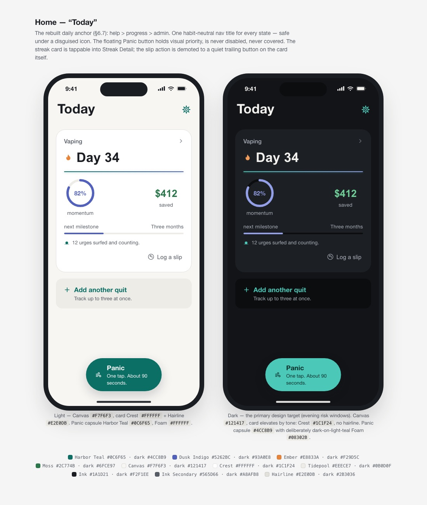
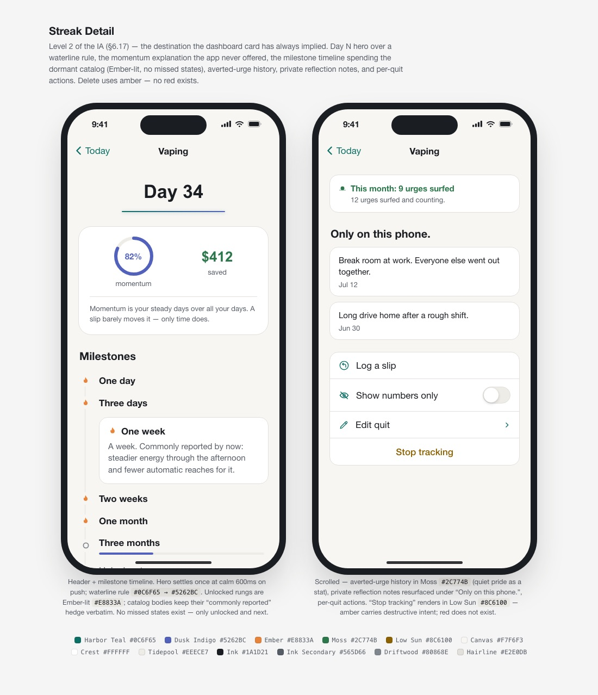
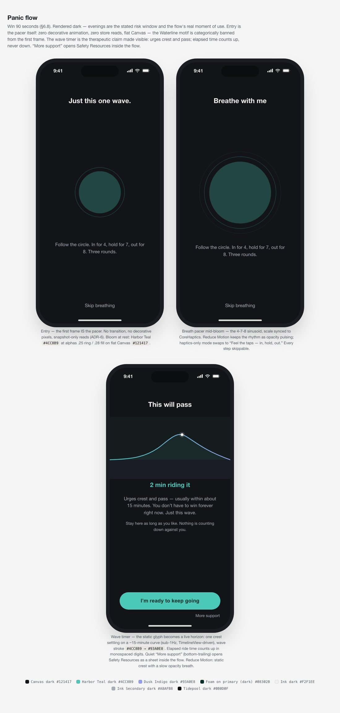
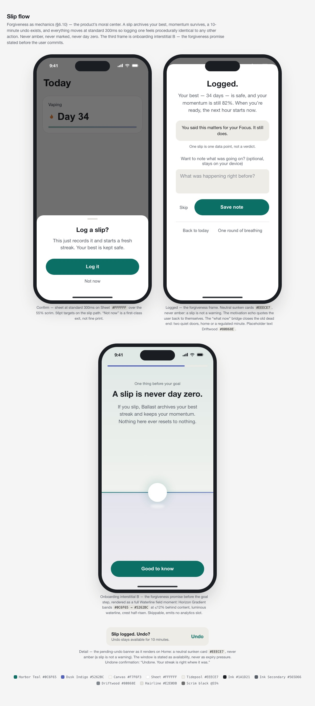
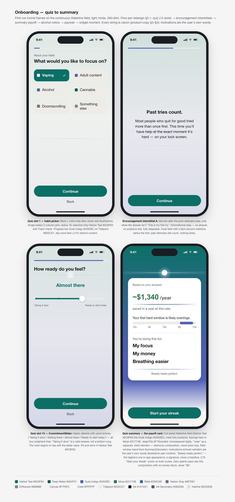
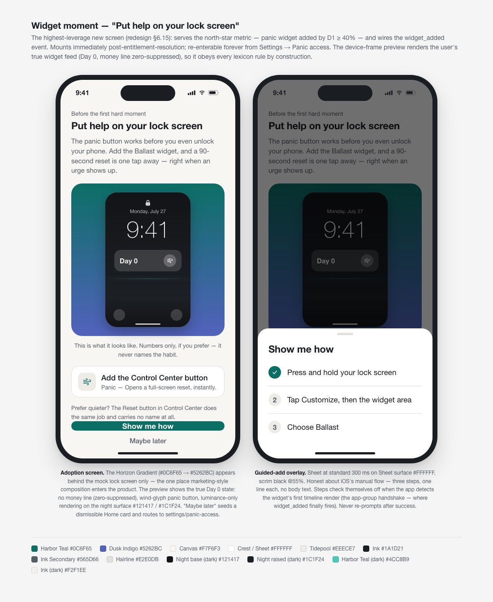
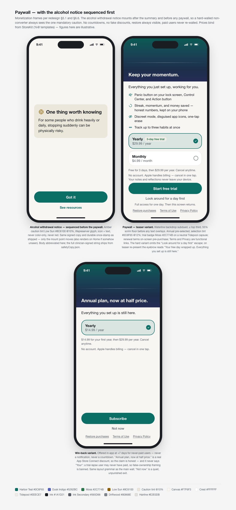
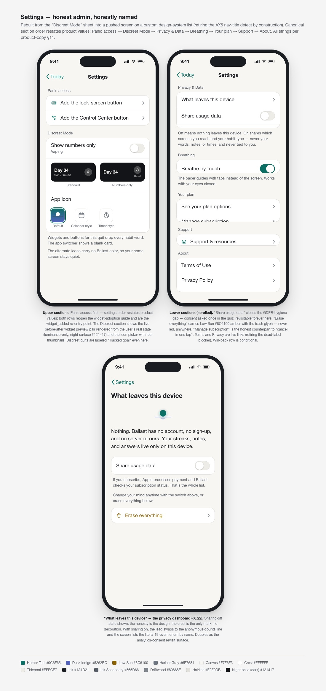

# Ballast — Screen Designs

Design-system screen cards for the redesign. Each `.html` file is a self-contained
board (open it in a browser for the full-resolution version with light **and** dark
frames); the previews below are static renders. The written spec for every screen —
layout, hierarchy, states, motion — lives in [`../ui-ux-redesign.md`](../ui-ux-redesign.md).
Icon concepts are in [`../icons/`](../icons/). The same cards are browsable in the
**Ballast Design System** project on claude.ai/design.

| Screen | Card | What it shows |
|---|---|---|
| Home — Today | [`home.html`](./home.html) | Rebuilt dashboard: "Today" title, panic button priority, streak card momentum states |
| Streak Detail | [`streak-detail.html`](./streak-detail.html) | Milestone track (43-body catalog), averted-urge stat, reflection notes |
| Panic flow | [`panic-flow.html`](./panic-flow.html) | Entry → breath → live wave count-up timer ("urges crest and pass") |
| Slip flow | [`slip-flow.html`](./slip-flow.html) | Slip logging + forgiveness frame ("A slip is never day zero") |
| Onboarding | [`onboarding.html`](./onboarding.html) | Quiz with encouragement interstitials → summary ("Start your streak") |
| Widget moment | [`widget-moment.html`](./widget-moment.html) | "Put help on your lock screen" adoption screen with live widget preview |
| Paywall | [`paywall.html`](./paywall.html) | Paywall with the alcohol notice sequenced first |
| Settings | [`settings.html`](./settings.html) | Canonical section order incl. "What leaves this device" |

## Previews

### Home — Today

### Streak Detail

### Panic flow

### Slip flow

### Onboarding

### Widget moment

### Paywall

### Settings

